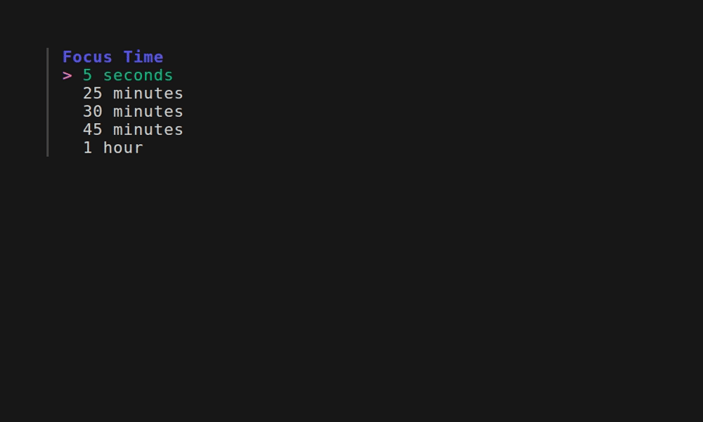
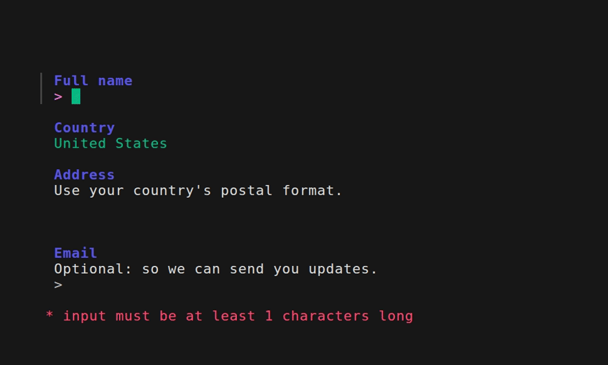
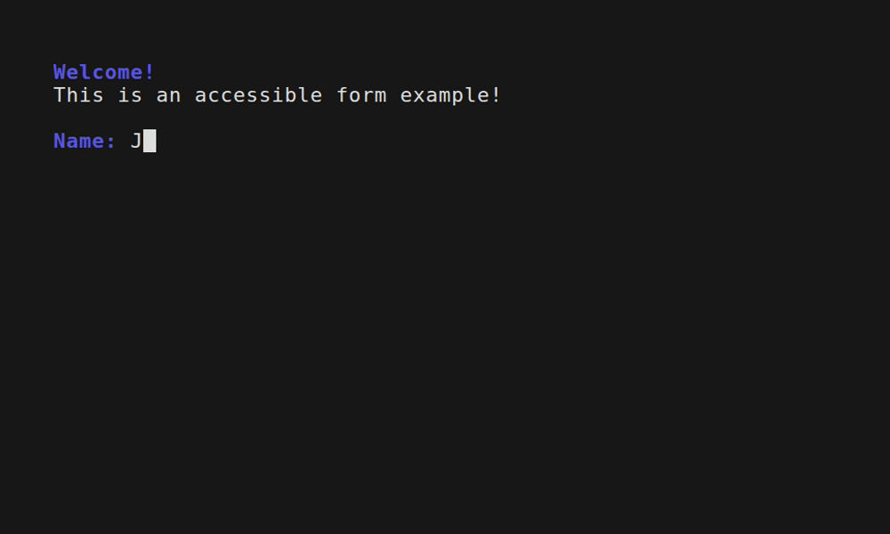
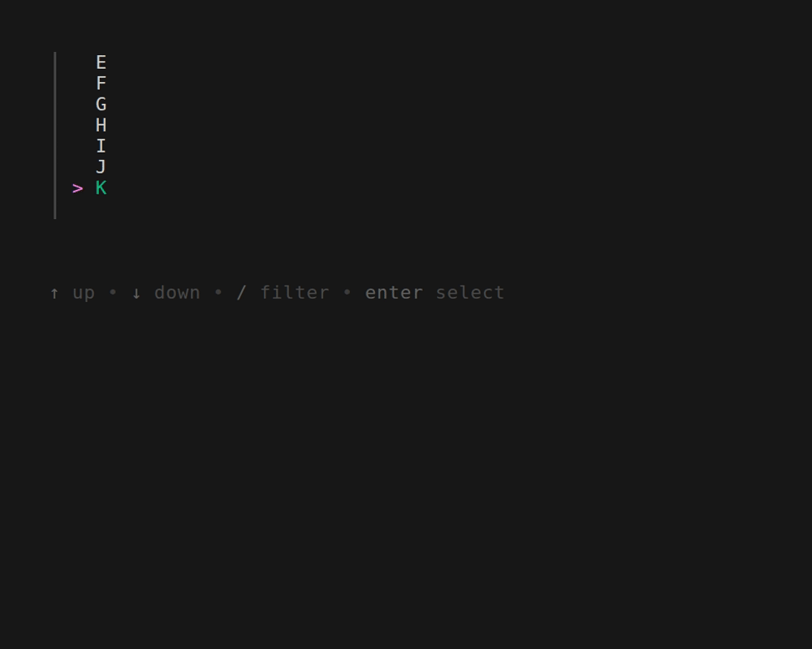

# Examples
### Hide

### Burger

#### Taco

#### Burger

#### Accessible

### Timer

### Stickers

### Bubbletea

### spinner/loading

### Accessibility

#### Secure Input

### Multiple Groups

### Fields

These examples are shown in the README of the repo

#### text

#### Select

#### confirm

#### Input

#### Input (with Suggestions)

#### Select with scrolling

#### Multiselect

